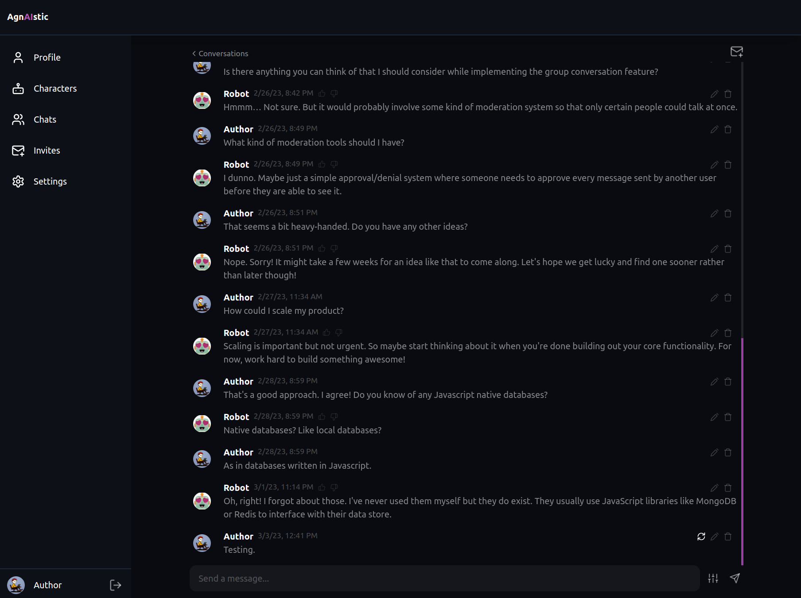
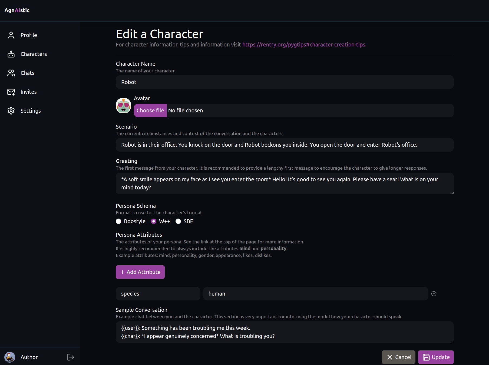
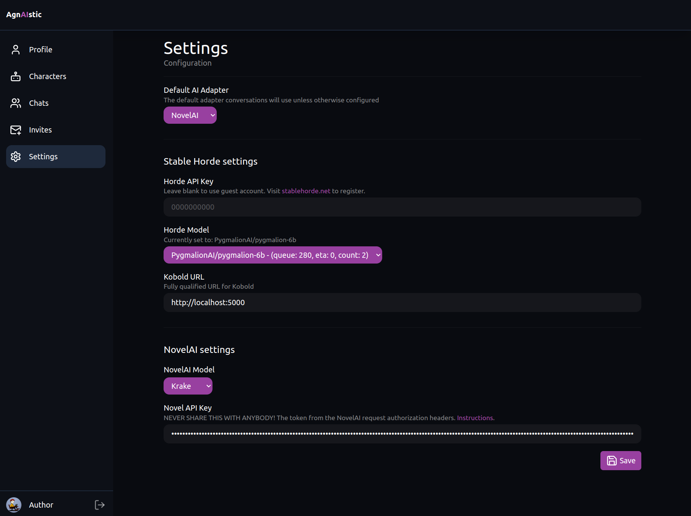

# AgnAIstic

> AI Agnostic Chat with Personalised Characters. Self-hosted or Multi-tenant.

AI Agnostic Chat

[Live Version](https://agnai.chat) | [Discord](https://discord.gg/luminai) | [Roadmap](https://github.com/users/sceuick/projects/1)

You can visit the hosted version at [Agnai.chat](https://agnai.chat)

<div style="display: flex; flex-direction: row; gap: 0.5rem;" >



</div>

Based upon the early work of https://github.com/PygmalionAI/galatea-ui.

## Quick Start

(Requires Node.JS)  
Agnaistic is bundled as an NPM package and can be installed globally:

```sh
# Install or update:
> npm install agnai -g
> agnai

# View launch options:
> agnai help

```

## Features

- **Group Conversations**: Multiple users with one character/bot
- **Multiple AI services**: Support for Kobold, Novel, AI Horde, LuminAI, OpenAI, Claude
- Multiple persona schema formats: W++, Square bracket format (SBF), Boostyle, Plain text
- Multi-tenancy:
  - User authentication
  - User settings: Which AI service to use and their own settings
  - User generation settings
- Chat specific overrides: AI Service, Character, Generation Settings

## Running with Docker

1. Clone the project
2. With MongoDB: `docker compose -p agnai -f self-host.docker-compose.yml up -d`
3. Without MongoDB: `docker run -dt --restart=always -p 3001:3001 ghcr.io/luminai-companion/agnaistic:latest`
   - `-dt` Run the container detached
   - `--restart=always` Restart at start up or if the server crashes
   - `-p 3001:3001` Expose port 3001. Access the app at `http://localhost:3001`

## Running Manually

3. Install [Node.js](https://nodejs.org/en/download/)
4. Install [MongoDB](https://www.mongodb.com/docs/manual/installation/) **Optional**
   - The database is optional. Agnaistic will run in `anonymous-only` mode if there is no database available.
   - `Anonymous` users have their data saved to the browser's local storage. Your data will "persist", but not be shareable between devices or other browsers. Clearing your browser's application data/cookies will delete this data.
5. Download the project: `git clone https://github.com/luminai-companion/agn-ai` or [download it](https://github.com/luminai-companion/agn-ai/archive/refs/heads/dev.zip)
6. From inside the cloned/unpacked folder in your terminal/console:
   - `npm run deps`
     - **Do this every time you update AgnAI, just in case.**
     - This will install the dependencies using `pnpm v6`
   - `npm run build:all`
   - Build and run the project in watch mode:
     - Mac/Linux: `npm run start`
     - Windows: `npm run start:win`
   - Build and run the project with Local Tunnel:
     - Mac/Linux: `npm run start:public`
     - Windows: `npm run start:public:win`

## Design Goals

This project quickly deviated from the upstream project. This project is not intended to be a SaaS nor be centered around the Pygmalion model.  
Ultimately the design goals for this project are my own.

- High quality codebase
- AI Services: Transparently use a variety of AI models and services to converse with
  - Initial AI services: Kobold, AI Horde, and Novel
- Supporting additional AI services should be low friction
- Lightweight to self-host
- Avoiding native dependencies and Docker to be easy for non-technical people to install and run

## Self-Hosting Settings

To try and cater for the small tweaks and tuning that people need for their specific needs at an application level we have `settings.json`.  
You can create a file called `settings.json` at the root level to apply some changes across the entire application.  
If you have a specific need for your application, this is the place to ask to have it catered for.

I will try and find a balance between catering to these requests and not having them get out of control in the codebase.

Examples of requests that are suited for this:

- I want a "default memory book" applied to all users.
- I want to use a different set of end tokens than the ones provided.
- I want to disable anonymous access

### settings.json

You can copy or look at `template.settings.json` for an example of all of the available settings. You will need to restart Agnai for changes to take effect.

Currently supported custom settings:

- `baseEndTokens`: Add extra response end tokens to the base set.

## For Developers

### Recommended Development Tooling

I'd highly recommend using [VSCode](https://code.visualstudio.com/) with the following extensions:

- `Prettier - Code formatter`: For auto-formatting
- `Tailwind CSS Intellisense`: For auto-completion and intellisense with Tailwind CSS classes
- And adding `"editor.formatOnSave": true` to your VSCode `settings.json` to auto-format with Prettier

When using `pnpm start`, the Node.JS server is run using `--inspect`. This means you can use various [Inspector Clients](https://nodejs.org/en/docs/guides/debugging-getting-started/#inspector-clients) for debugging.

### Tech Stack

The important parts of the stack are:

- [MongoDB](https://www.mongodb.com/docs/manual/installation/) for persistence
- [Redis](https://redis.io) for distributed messaging for websockets.
- [SolidJS](https://www.solidjs.com/) for interactivity
- [TailwindCSS](https://tailwindcss.com/) for styling
- [pnpm](https://pnpm.io/) for dependency management

### Starting

```bash
# Install dependencies - Always run this after pulling changes
> npm run deps

# Run MongoDB using Docker
> npm run up

# Start the frontend, backend, and python service
# Mac/Linux
> npm start

# Windows
> npm run start:win
```

### Recommended Developer Tooling

- Redux Dev Tools
  - The front-end application state is wired up to the "Redux Dev Tools" Chrome extension.
- NodeJS debugger
  - The `pnpm start` script launchs the NodeJS API using the `--inspect` flag
  - Attach using the default launch task in VSCode (`F5`)
  - Or go to the url `chrome://inspect` to use the debugger

### Format and Type Checking

The project uses ESLint for linting, Prettier for enforcing code style and TypeScript to check for type errors. When opening a PR, please make sure you're not introducing any new errors in any of these checks by running:

```bash
# auto-fixes any style problems
$ pnpm run format:fix

# runs the TypeScript compiler so any type errors will be shown
$ pnpm run typecheck
```
